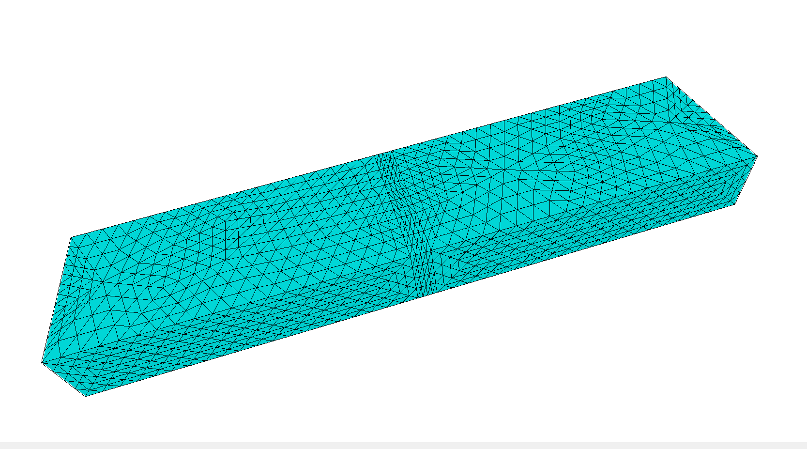
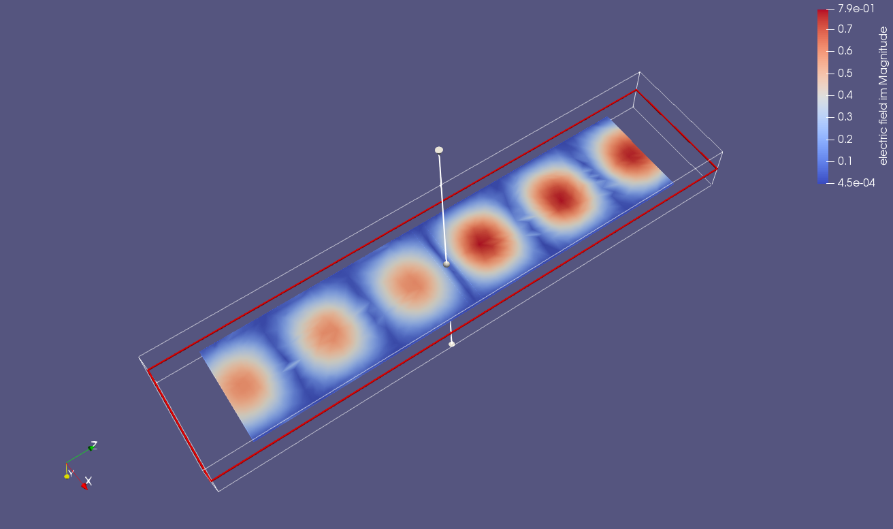

# waveguide demo
feasibility study on using Elmer for microwave optimization

The problem includes a simple straight WR90 waveguide with a 2.3 mm thick section of dielectric representing a quartz window. 
Beware that due to dimensions in mm Elmer is set up tp simulate a problem for 10 MHz not 10 GHz 

Model body is created in gmsh manually. Beware that if a .step file is imported there might be two mating boundaries between surfaces,
in that case the wave will not propagate. The boundary surface must be *shared* between two bodies i.e. 
be the boundary for both of  them, not only one.

Created i gmsh mesh is exported in unv format and used in Elmer. For instructions on Elmer for Vector Helmholtz equation look at 
official  ([Elmer manual](http://www.nic.funet.fi/index/elmer/doc/ElmerTutorials.pdf))

The simulation results are visualized using Paraview

